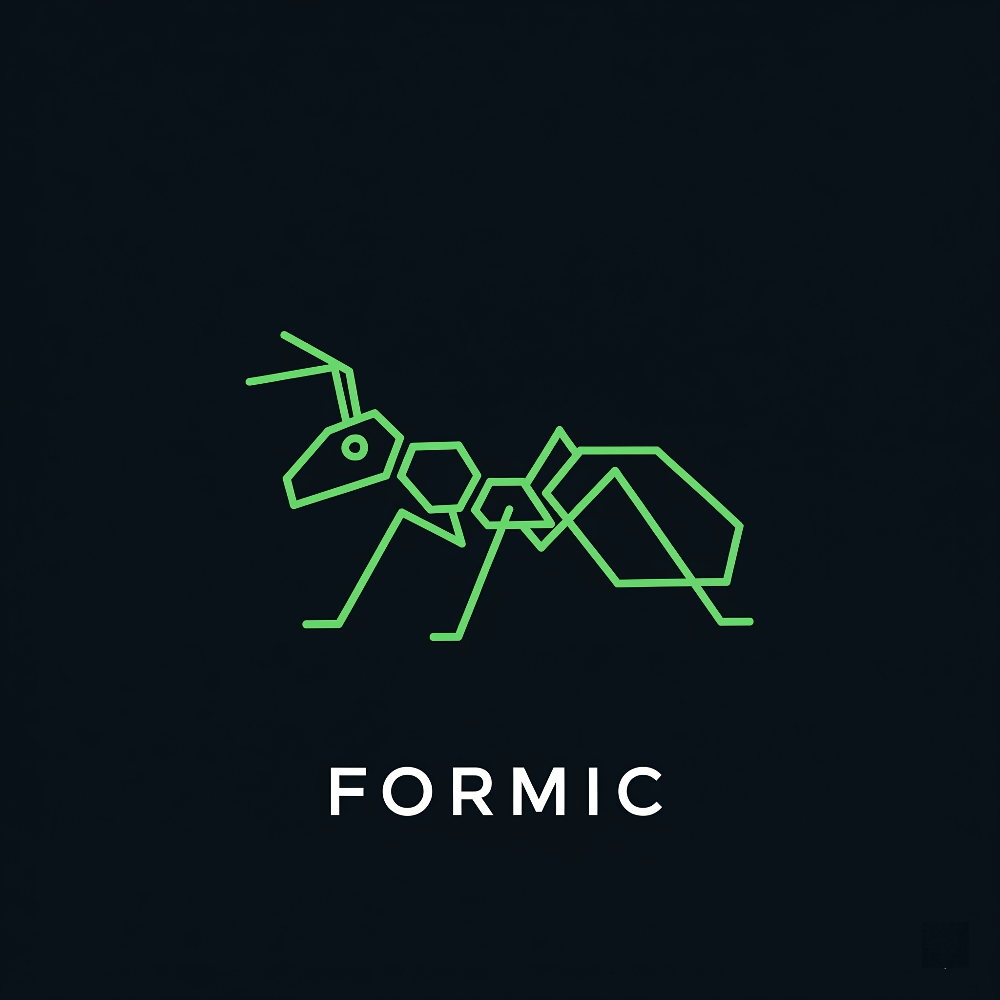
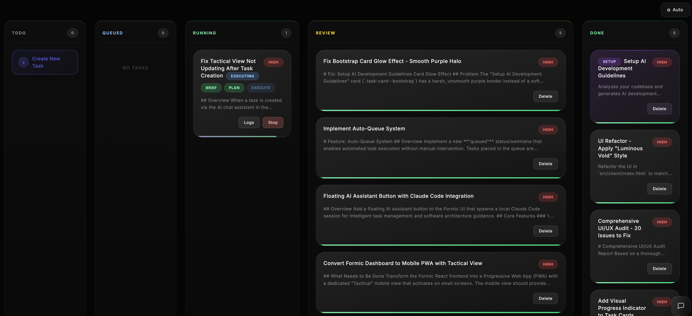

<p align="center">
  
</p>

<p align="center">
  <strong>The Local-First Agent Orchestration Environment</strong>
</p>

<p align="center">
  <em>Vibe Coding with autonomous agents. Your repo, your rules, their labor.</em>
</p>

<p align="center">
  <a href="#quickstart"></a>
  <a href="LICENSE"></a>
  
  
</p>

<p align="center">
  <a href="#quickstart">Quickstart</a> •
  <a href="#why-formic">Why?</a> •
  <a href="#features">Features</a> •
  <a href="#supported-agents">Agents</a> •
  <a href="#documentation">Docs</a> •
  <a href="#contributing">Contributing</a>
</p>

---

<p align="center">
  
  <br>
  <em>Mission Control for your AI coding agents</em>
</p>

---

## Why Formic?

**The Problem:** You have an AI coding agent. You have a codebase. But every task becomes a context dump, a prompt engineering session, and a prayer that the agent remembers what you told it five minutes ago.

**The Solution:** Formic sits between you and your AI agent like a competent project manager. You describe what you want. Formic breaks it into specs, plans, and subtasks. The agent executes. You review.

```
┌─────────────────────────────────────────────────────┐
│  You: "Add dark mode"                               │
│           ↓                                         │
│  Formic: Generates README.md (spec)                 │
│           ↓                                         │
│  Formic: Generates PLAN.md + subtasks.json          │
│           ↓                                         │
│  Agent: Implements all subtasks autonomously        │
│           ↓                                         │
│  You: Review, approve, ship                         │
└─────────────────────────────────────────────────────┘
```

**Vibe Coding Philosophy:**
- 🐜 **Agents do the labor** — You define intent, they write code
- ⚡ **Local-first** — Your repo, your machine, zero cloud lock-in
- 🎯 **Structured autonomy** — Every task gets specs, plans, and tracked subtasks

---

## Quickstart

### 🐳 One Command

```bash
docker run -p 8000:8000 \
  -v /path/to/your/project:/app/workspace \
  -e ANTHROPIC_API_KEY=your-api-key \
  ghcr.io/your-org/formic:latest
```

Open `http://localhost:8000` and start creating tasks.

### Three Steps to Autonomous Development

1. **Create a task** — Describe what you want in plain English
2. **Click Run** — Formic auto-generates specs, plans, and executes
3. **Review & ship** — Agent moves completed work to Review for your approval

That's it. No prompt engineering. No context management. No babysitting.

---

## Features

| Feature | Description |
|---------|-------------|
| 🐜 **Kanban Board** | Drag-and-drop task management across `todo`, `queued`, `running`, `review`, `done` |
| ⚡ **Live Terminal** | Real-time agent output streaming via WebSocket |
| 📋 **Auto-Documentation** | Every task gets README.md, PLAN.md, and structured subtasks |
| 🔄 **Iterative Execution** | Agent loops until all subtasks are complete |
| 🎯 **Smart Bootstrap** | Auto-generates project-specific coding guidelines on first run |
| 🔌 **Multi-Agent** | Switch between Claude Code CLI and GitHub Copilot CLI |
| 🚀 **Auto-Queue** | Queue tasks for automatic execution with priority ordering |
| 🌿 **Branch Isolation** | Each queued task runs on its own git branch |

### Workflow

```
┌─────────────────────────────────────────────────────────────┐
│  BRIEF → Generate README.md (what to build)                 │
│            ↓                                                │
│  PLAN  → Generate PLAN.md + subtasks.json (how to build)    │
│            ↓                                                │
│  EXECUTE → Iterative loop until all subtasks complete       │
└─────────────────────────────────────────────────────────────┘
```

### Auto-Queue System

Queue tasks for hands-off execution. The system automatically:
- Picks tasks by **priority** (high > medium > low), then **FIFO**
- Creates an isolated **git branch** per task (`formic/t-{id}_{slug}`)
- Tracks branch status (ahead/behind/conflicts)

```
┌─────────────────────────────────────────────────────────────┐
│  TODO Column        →  Manual trigger only (click "Run")    │
│  QUEUED Column      →  Auto-triggered by queue processor    │
└─────────────────────────────────────────────────────────────┘
```

**Configuration:**
```bash
# Max parallel tasks (default: 1)
export MAX_CONCURRENT_TASKS=2

# Queue poll interval in ms (default: 5000)
export QUEUE_POLL_INTERVAL=3000
```

**Branch Conflict Resolution:**
When a task branch has merge conflicts, click "Create Conflict Resolution Task" to generate a pre-filled task for resolving the conflicts.

---

## Supported Agents

| Agent | Command | Auth | Status |
|-------|---------|------|--------|
| **Claude Code CLI** | `claude` | `ANTHROPIC_API_KEY` | ✅ Default |
| **GitHub Copilot CLI** | `copilot` | GitHub OAuth | ✅ Supported |

Switch agents via environment variable:

```bash
# Claude (default)
export AGENT_TYPE=claude
export ANTHROPIC_API_KEY=your-key

# GitHub Copilot
export AGENT_TYPE=copilot
# Uses your existing GitHub auth
```

---

## Documentation

### Project Structure

```
your-project/
├── src/
├── package.json
└── .formic/                      # Auto-created
    ├── board.json                # Kanban state
    └── tasks/
        └── t-1_add-dark-mode/
            ├── README.md         # Feature spec
            ├── PLAN.md           # Implementation plan
            └── subtasks.json     # Tracked progress
```

### Environment Variables

| Variable | Description | Default |
|----------|-------------|---------|
| `PORT` | Server port | `8000` |
| `WORKSPACE_PATH` | Project directory | `/app/workspace` |
| `AGENT_TYPE` | Agent to use | `claude` |
| `ANTHROPIC_API_KEY` | Claude API key | Required for Claude |
| `MAX_CONCURRENT_TASKS` | Max parallel queued tasks | `1` |
| `QUEUE_POLL_INTERVAL` | Queue check interval (ms) | `5000` |

### API

| Endpoint | Description |
|----------|-------------|
| `GET /api/board` | Fetch board state |
| `POST /api/tasks` | Create task |
| `POST /api/tasks/:id/run` | Execute full workflow |
| `WS /ws/logs/:taskId` | Stream agent output |

Full API reference in [SPEC.md](SPEC.md).

---

## Tech Stack

| Component | Technology |
|-----------|------------|
| Runtime | Node.js 20 + TypeScript |
| Server | Fastify |
| WebSocket | @fastify/websocket |
| Frontend | Vanilla HTML/CSS/JS |
| Terminal | xterm.js |
| Agent | Claude Code / GitHub Copilot |
| Deployment | Docker |

---

## Development

```bash
# Clone
git clone https://github.com/your-org/formic.git
cd formic

# Install
npm install

# Run (development)
npm run dev

# Build
npm run build

# Run (production)
npm start
```

---

## Roadmap

- [x] Kanban board with drag-and-drop
- [x] Live terminal output streaming
- [x] Auto-bootstrap project guidelines
- [x] 3-step workflow (brief → plan → execute)
- [x] Iterative execution with subtask tracking
- [x] Multi-agent support (Claude + Copilot)
- [x] Auto-queue with priority ordering
- [x] Git branch isolation per task
- [x] Branch status detection & conflict resolution
- [ ] Task dependencies
- [ ] Auto-merge after review
- [ ] PR creation from task branches
- [ ] Cloud deployment option

---

## Contributing

Contributions welcome. Please read [CONTRIBUTING.md](CONTRIBUTING.md) before submitting PRs.

```bash
# Run tests
npm test

# Lint
npm run lint
```

---

## License

[MIT](LICENSE) — Use it, fork it, ship it.

---

<p align="center">
  <strong>🐜 Formic</strong>
  <br>
  <em>Let the agents do the work.</em>
</p>
