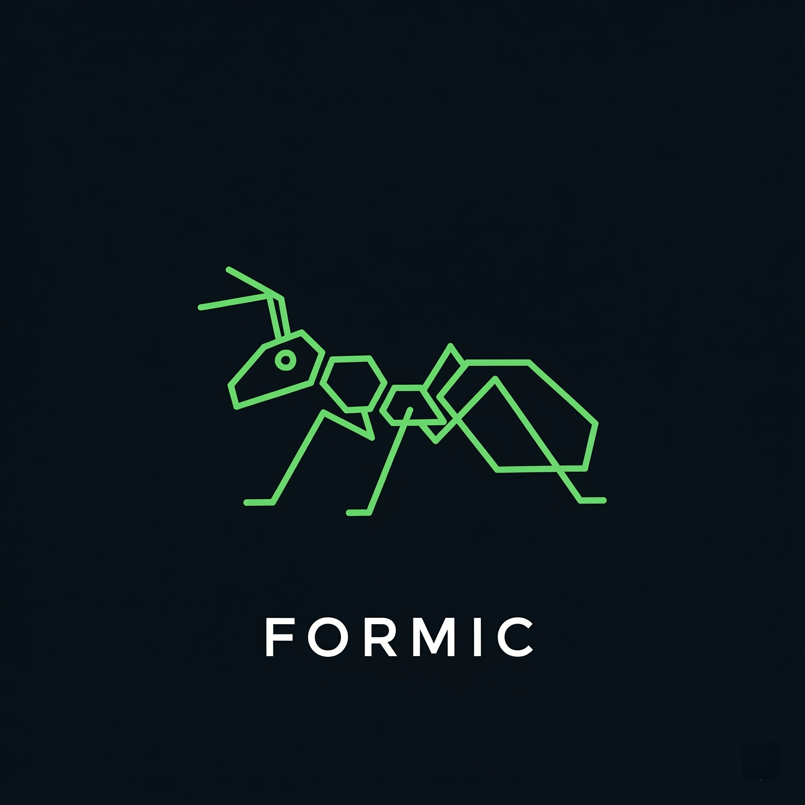
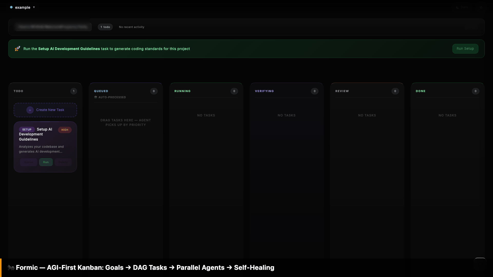
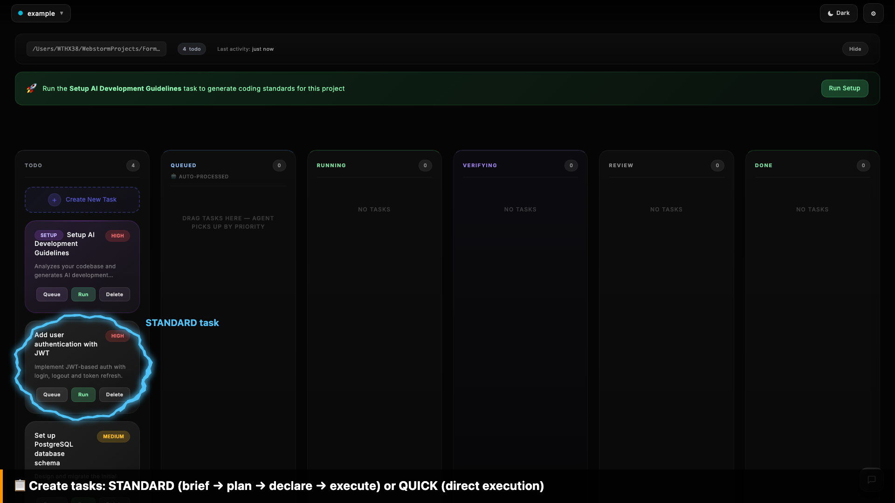
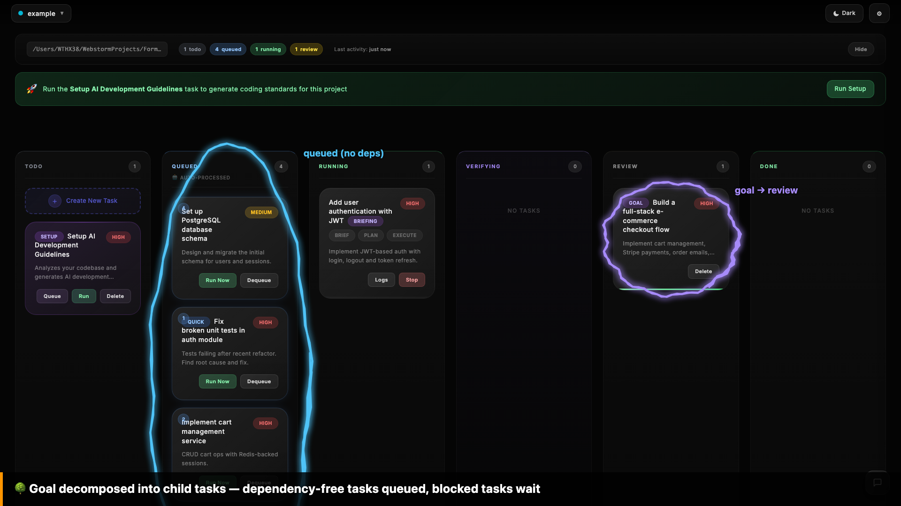
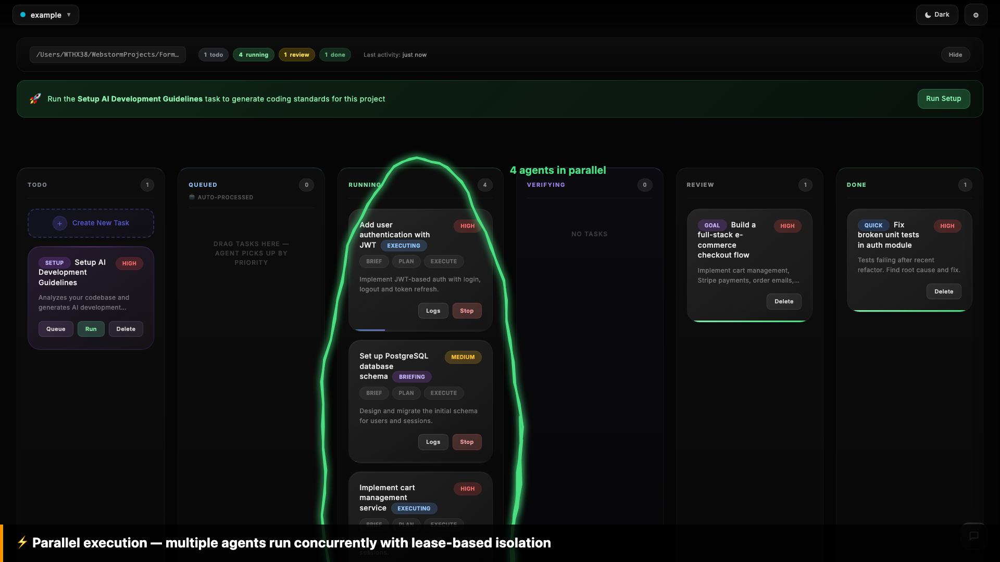
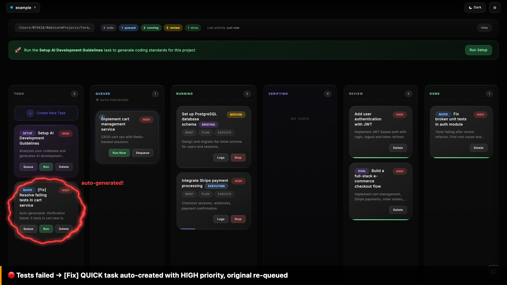

<p align="center">

</p>

<p align="center">
<a href="https://www.npmjs.com/package/@rickywo/formic"></a>


<a href="LICENSE"></a>
</p>

# Formic - AGI-First Kanban for Autonomous Software Engineering

Formic turns your repository into a self-organizing AI software team. Goals become decomposed task graphs (DAGs), agents coordinate through file leases, and a persistent memory system ensures your team learns from every mistake.

Formic is a local-first operating system for AI agents. It orchestrates Claude Code CLI or GitHub Copilot CLI on your machine, providing the management layer required for truly autonomous development.

## Why Formic?

Most AI coding tools stop at conversation. Formic builds the infrastructure for autonomy:

- **Goal-Driven Architecture**: High-level objectives are automatically decomposed into dependency-aware task graphs.
- **Industrial Concurrency**: Safely run multiple agents in parallel with an exclusive/shared file lease system.
- **Self-Healing Loops**: Built-in verifier and critic loops that automatically detect errors and create high-priority fix tasks.
- **Persistent Memory**: A reflection system that captures "lessons learned," ensuring agents don't fall into the same pitfall twice.

```
Goal task     -> architect -> child tasks (queued + blocked DAG)
Standard task -> brief -> plan -> declare -> execute -> verify -> review
Quick task    -> execute -> verify -> review
```

## Key Features

### Objective-Based Planning (DAG)

Switch to **Objective Mode** to input high-level goals. Formic's **architect skill** breaks goals into 3-8 child tasks, detecting dependencies using Kahn's Algorithm. Prerequisite tasks are queued immediately, while dependent tasks remain blocked until their parents reach `done`.

### Parallel Agent Orchestration

Formic optimizes your compute. Agents perform a **declare** step to identify file needs, then acquire exclusive or shared leases.

- **Conflict Management**: Shared files use optimistic collision detection via `git hash-object`.
- **Preemption**: High-priority tasks can preempt low-priority resource holders.
- **Deadlock Prevention**: Automated cycle detection in the wait-for graph ensures the queue never stalls.

### Bulletproof Self-Healing

Formic prioritizes project integrity.

- **Safety Net**: Creates a git safe-point commit before every execution.
- **Verifier & Critic**: When `VERIFY_COMMAND` is set, Formic runs a closed-loop verification. If tests fail, it auto-creates a "Fix" task with high priority.
- **Emergency Stop**: After repeated failures, Formic resets the workspace to the safe-point and pauses the queue for human intervention.

### Long-Term Memory & Tool Forging

Formic evolves with your project.

- **The Hippocampus**: After every task, the agent reflects on the experience. Lessons are stored in `.formic/memory.json` and automatically injected into the context of relevant future tasks.
- **Tool Building**: Agents can "forge" their own scripts in `.formic/tools/` to automate repetitive project-specific actions, which are then made available to the entire team.

## Quick Start

### 1. Requirements

- Node.js 20+ and Git
- [Claude Code CLI](https://docs.anthropic.com/en/docs/claude-code) (authenticated) or GitHub Copilot CLI

### 2. Install via npm (recommended)

```bash
npm install -g @rickywo/formic
```

Then navigate to your project and start the server:

```bash
cd /path/to/your/project
formic start
```

### 3. Install from source

```bash
git clone https://github.com/rickywo/Formic.git
cd Formic
npm install
npm run build

# Point to your target workspace
WORKSPACE_PATH=/path/to/your/project npm run start
```

For development with hot reload:

```bash
WORKSPACE_PATH=/path/to/your/project npm run dev
```

### 4. Your First Goal

1. Open http://localhost:8000.
2. Click **Create New Task** and select the **Goal** task type.
3. Enter a goal: "Implement a dark mode toggle that persists to local storage."
4. Watch Formic decompose the goal, queue tasks, and start executing.

## Configuration

All configuration is via environment variables. Set them in your shell or in a `.env` file in your workspace root.

| Variable | Description | Default |
| --- | --- | --- |
| `AGENT_TYPE` | Agent CLI to use: `claude` or `copilot` | `claude` |
| `PORT` | Server port | `8000` |
| `WORKSPACE_PATH` | Target workspace directory | `./workspace` |
| `MAX_CONCURRENT_TASKS` | Maximum parallel agent executions | `1` |
| `VERIFY_COMMAND` | Shell command for post-execution verification (e.g., `npm test`) | _(disabled)_ |
| `SKIP_VERIFY` | Skip verification step entirely | `false` |
| `LEASE_DURATION_MS` | File lease duration before expiration | `300000` (5 min) |
| `WATCHDOG_INTERVAL_MS` | Lease watchdog scan interval | `30000` (30s) |
| `MAX_YIELD_COUNT` | Max lease-conflict yields before skipping a task | `50` |
| `QUEUE_POLL_INTERVAL` | Queue processor poll interval | `5000` (5s) |
| `MAX_EXECUTE_ITERATIONS` | Max iterative execution loops per task | `5` |
| `STEP_TIMEOUT_MS` | Timeout for individual workflow steps | `6000000` (100 min) |

## Task Types

Formic supports three task types:

- **Standard** (default): Full workflow — brief → plan → declare → execute → verify → review. Suitable for most feature work.
- **Quick**: Single-step execution — skips briefing and planning. Ideal for small fixes, typos, or simple changes.
- **Goal**: Architect-driven decomposition — analyzes a high-level goal and breaks it into 3–8 child tasks with dependency ordering. Child tasks follow their own standard or quick workflow.

## Visualizing the AGI in Action

### Demo — Full Workflow

Goal creation → architect decomposition → lease-aware parallel execution → verification → self-healing recovery.



---

### Kanban Board

Tasks organized across TODO, QUEUED, RUNNING, VERIFYING, REVIEW and DONE. Each card shows its type, priority, and current workflow step at a glance.



### Goal Decomposition — DAG in Action

A high-level goal is submitted and the architect skill decomposes it into child tasks. The goal card moves to Review while its children are queued across the board — dependency-blocked tasks stay blocked until their prerequisites are done.



### Parallel Agent Execution

Four tasks running simultaneously, each showing its current workflow stage badge (EXECUTING, BRIEFING). The status bar confirms 4 running in parallel, with a QUICK task already done.



### Self-Healing Loop — Verifier & Critic

When verification fails, Formic auto-generates a `[Fix]` QUICK HIGH task in TODO — with the exact failure context pre-filled — and re-queues the original task. The board keeps moving without human intervention.



## Messaging Integration

Formic supports Telegram and LINE bots for remote task management. See the [Messaging Integration Guide](docs/MESSAGING_INTEGRATION_GUIDE.md) for setup instructions.

| Variable | Description |
| --- | --- |
| `TELEGRAM_BOT_TOKEN` | Telegram Bot API token (from @BotFather) |
| `LINE_CHANNEL_ACCESS_TOKEN` | LINE Messaging API channel access token |
| `LINE_CHANNEL_SECRET` | LINE Messaging API channel secret |

## Contributing

Formic is built for developers who want AI agents to behave like a coordinated software team. If you're improving the platform, prioritize implementation-backed features over roadmap language.

## License

[MIT](LICENSE)
